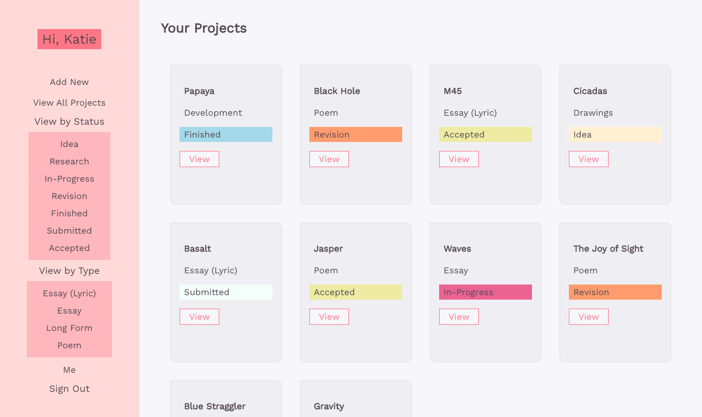
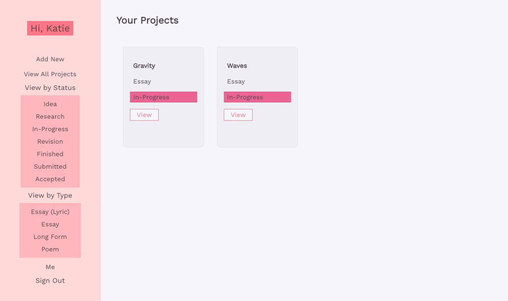

## About Papaya!

I'm made this project for a few reasons:

1. I thought it might be nice to have a project organizer for my excessive amounts of projects, spanning poetry, paintings, and web development. (I was wrong, once I was finished, it just felt like one more thing to manage!)

2. I wanted more practice with React and Redux

3. I wanted a deeper understanding of Auth, and to do it from scratch myself, using JWT.

4. To learn an ORM, Sequelize!

## Functionality includes:

- Sign Up
- Sign In
- Sign Out
- Add New Project
- View Project Details
- Update Project Details
- Delete Project
- View All Projects
- View Projects by Type
- View Project by Status

## Technology Used:

- React & Redux
- HTML, CSS
- Node, Express
- PostreSQL with Sequelize
- JSON Web Tokens for Auth

## What it looks like:

Sign Up:

View All Projects:

View Project Details:

Add New Project:

View By Type:

View By Status:

