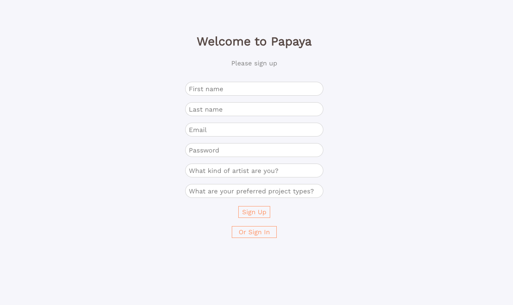
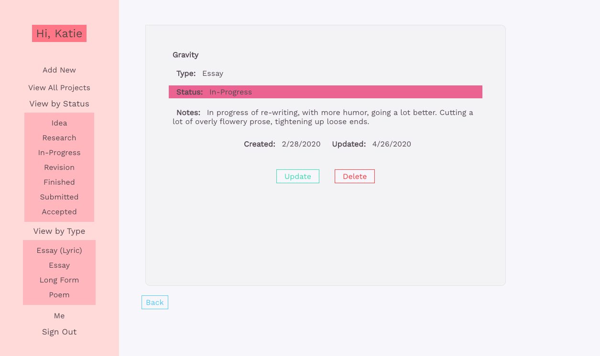
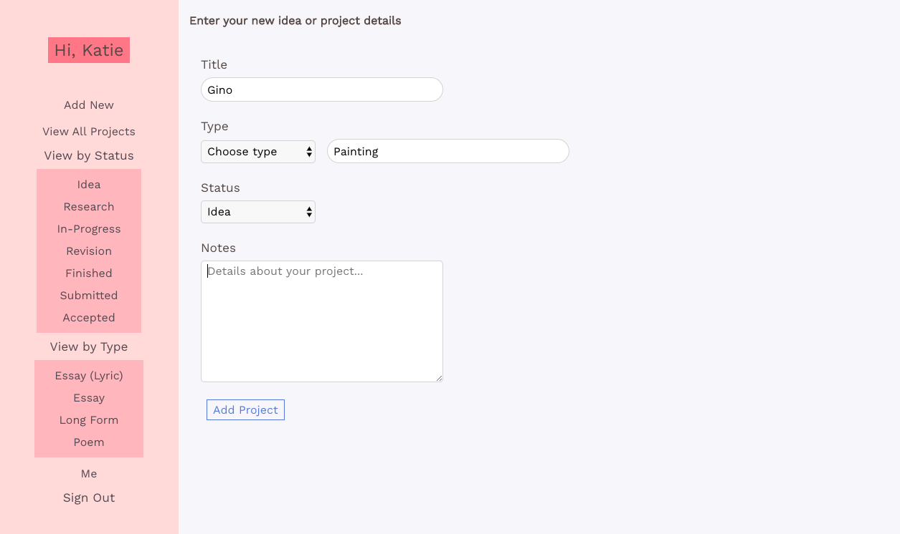
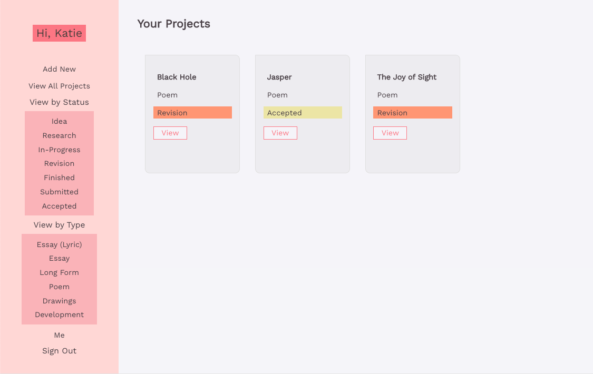
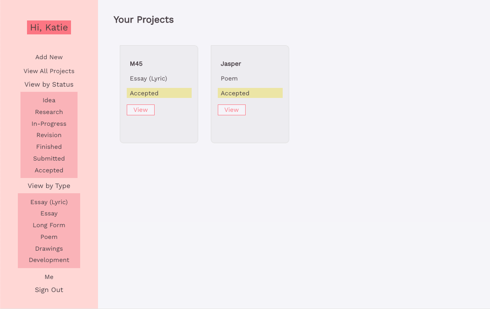

## About Papaya!

I made this project for a few reasons:

1. I thought it might be nice to have a project organizer for my excessive amounts of projects, spanning poetry, paintings, and web development. (I was wrong, once I was finished with this, using it just felt like one more thing to manage!)

2. I wanted more practice with React and Redux

3. I wanted a deeper understanding of Auth, and to do it from scratch myself, using JWT.

4. To learn Sequelize!

## Functionality includes:

- Sign Up
- Sign In
- Sign Out
- Add New Project
- View Project Details
- Update Project Details
- Delete Project
- View All Projects
- View Projects by Type
- View Projects by Status

## Technology Used:

- React & Redux
- HTML, CSS
- Node, Express
- PostgreSQL with Sequelize
- JSON Web Tokens for Auth

## Status:

This project is about 97% done. There is some styling that needs to be completed, and it needs to be deployed. BUT: I've been working on it on-and-off for over a year and have grown a lot in my skills, and have decided to leave it at 97% so I can move on to learning and building new things. I'm grateful for all this project taught me, which was A LOT. If I have the free time in the future, I'd love to finish the styling and learn Heroku in order to deploy it :)

## What it looks like:

Sign Up:
(Or sign in!)

View All Projects:

View Project Details:
(From here you may also UPDATE or DELETE a project)

Add New Project:
(You can CHOOSE project type from dropdown or ADD a new project type in the input field adjacent to it)

View By Type:

View By Status:

